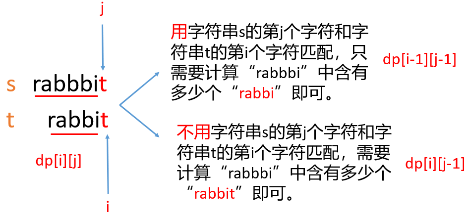

## 01.不同的子序列

### 来源： LeetCode 第 `115` 题

### 难度： 🔥🔥🔥 困难

### 描述：

给定一个字符串`s` 和一个字符串`t` ，计算在`s`的子序列中`t` 出现的个数。
字符串的一个子序列是指， 通过删除一些（ 也可以不删除） 字符且不干扰剩余字符相对位置
所组成的新字符串。（ 例如， " A C E " 是" A B C D E " 的一个子序列， 而" A E C " 不是）
题目数据保证答案符合 `32` 位带符号整数范围。

### 示例 1:

```bash

输入: s = "rabbbit", t = "rabbit"
输出: 3
解释:
如下图所示, 有 3 种可以从 s 中得到"rabbit"的方案。
`rabb`b`it`
`rab`b`bit`
`ra`b`bbit`
```

### 示例 2:

```bash
输入： s = " b a b g b a g " , t = " b a g "
输出： 5
解释：
如下图所示, 有5 种可以从s 中得到" b a g " 的方案。
`ba`b`g`bag
`ba`bgba`g`
`b`abgb`ag`
ba`b`gb`ag`
babg`bag`
```

### 提示

```bash
0<=s.length,t.length<=1000

`s` 和 `t` 由英文字母组成
```

### 动态规划解决

这题说的是`s`的子序列中出现 t 的个数，翻译一下就是字符串 s 的所有子序列中，和字符串 t 完全一样的有多少个。
我们定义`dp[i][j]`表示 t 的前`i`个字符可以由`s`的前`j`个字符组成的个数（也可以说是字符串`s`的前`j`个字符组成的子序列中，和字符串`t`的前 i 个字符组成的字符串一样的有多少个）。
那么最终我们只需要求出`dp[tLength][sLength]`即可（其中`tLength和sLength`分别表示字符串`t`和`s`的长度）。



如上图所示我们可以有两种选择。

如果字符串 `t` 的第 `i` 个字符和字符串 `s` 的第 `j` 个字符不一样，也就是说字符串 `s` 的第 `j` 个字符不能匹配字符串 `t` 的第 `i` 个字符。那么我们只能计算字符串 `s` 的前 `j-1` 个字符构成的子序列中包含字符串 `t` 的前 `i` 个字符组成的字符串的个数。

所以递推公式如下

```ts
for (int j = 1; j <= sLength; j++) {
    if (t.charAt(i - 1) == s.charAt(j - 1)) {
        //如果字符串t的第i个字符和s的第j个字符一样，
        //那么有两种选择
        dp[i][j] = dp[i - 1][j - 1] + dp[i][j - 1];
    } else {
        //如果字符串t的第i个字符和s的第j个字符不一样，
        //我们只能用字符串s的前j-1个字符来计算他包含的数量
        dp[i][j] = dp[i][j - 1];
    }

```

动态规划的三个步骤就是`定义状态`、`列出递推公式`,`找出边界条件`。前面两步我们都完成了，我们来看最后一个。因为空字符串""是所有字符串的子集，所以当字符串 t 为空的时候，dp[0][j]=1;

我们来看下最终代码

```js
public int numDistinct(String s, String t) {
    //sLength和tLength分别是两个字符串的长度
    int sLength = s.length();
    int tLength = t.length();
    int[][] dp = new int[tLength + 1][sLength + 1];

    //base case 边界条件
    for (int j = 0; j <= sLength; j++) {
        dp[0][j] = 1;
    }

    for (int i = 1; i <= tLength; i++) {
        for (int j = 1; j <= sLength; j++) {
            //下面是递推公式
            if (t.charAt(i - 1) == s.charAt(j - 1)) {
                //如果字符串t的第i个字符和s的第j个字符一样，
                //那么有两种选择
                dp[i][j] = dp[i - 1][j - 1] + dp[i][j - 1];
            } else {
                //如果字符串t的第i个字符和s的第j个字符不一样，
                //我们只能用字符串s的前j-1个字符来计算他包含的数量
                dp[i][j] = dp[i][j - 1];
            }
        }
    }
    return dp[tLength][sLength];
}
```

### 示例代码

#### javaScript

```js
var numDistinct = function (s, t) {
  let dp = new Array(s.length + 1);
  for (let i = 0; i < dp.length; i++) {
    dp[i] = new Array(t.length + 1).fill(0);
  }

  for (let i = 0; i < dp.length; i++) {
    dp[i][0] = 1;
  }

  for (let i = 1; i < dp.length; i++) {
    for (let j = 1; j < dp[0].length; j++) {
      if (s[i - 1] == t[j - 1]) {
        dp[i][j] += dp[i - 1][j - 1];
      }
      dp[i][j] += dp[i - 1][j];
    }
  }
  return dp[s.length][t.length];
};
```

- java

```js
class Solution {
    public int numDistinct(String s, String t) {
        int[][] dp = new int[s.length() + 1][t.length() + 1];
        for (int i = 0; i < s.length() + 1; i++) {
            dp[i][0] = 1;
        }

        for (int i = 1; i < s.length() + 1; i++) {
            for (int j = 1; j < t.length() + 1; j++) {
                if (s.charAt(i - 1) == t.charAt(j - 1)) {
                    dp[i][j] = dp[i - 1][j - 1] + dp[i - 1][j];
                }else{
                    dp[i][j] = dp[i - 1][j];
                }
            }
        }

        return dp[s.length()][t.length()];
    }
}
```

- python

```python
class Solution:
    def numDistinct(self, s: str, t: str) -> int:
        dp = [[0] * (len(t)+1) for _ in range(len(s)+1)]
        for i in range(len(s)):
            dp[i][0] = 1
        for j in range(1, len(t)):
            dp[0][j] = 0
        for i in range(1, len(s)+1):
            for j in range(1, len(t)+1):
                if s[i-1] == t[j-1]:
                    dp[i][j] = dp[i-1][j-1] + dp[i-1][j]
                else:
                    dp[i][j] = dp[i-1][j]
        return dp[-1][-1]


```

- python3

```python

class SolutionDP2:
    """
    既然dp[i]只用到dp[i - 1]的状态，
    我们可以通过缓存dp[i - 1]的状态来对dp进行压缩，
    减少空间复杂度。
    （原理等同同于滚动数组）
    """

    def numDistinct(self, s: str, t: str) -> int:
        n1, n2 = len(s), len(t)
        if n1 < n2:
            return 0

        dp = [0 for _ in range(n2 + 1)]
        dp[0] = 1

        for i in range(1, n1 + 1):
            # 必须深拷贝
            # 不然prev[i]和dp[i]是同一个地址的引用
            prev = dp.copy()
            # 剪枝，保证s的长度大于等于t
            # 因为对于任意i，i > n1, dp[i] = 0
            # 没必要跟新状态。
            end = i if i < n2 else n2
            for j in range(1, end + 1):
                if s[i - 1] == t[j - 1]:
                    dp[j] = prev[j - 1] + prev[j]
                else:
                    dp[j] = prev[j]
        return dp[-1]


```

- Go

  ```go
  func numDistinct(s string, t string) int {
    dp:= make([][]int,len(s)+1)
    for i:=0;i<len(dp);i++{
        dp[i] = make([]int,len(t)+1)
    }
    // 初始化
    for i:=0;i<len(dp);i++{
        dp[i][0] = 1
    }
    // dp[0][j] 为 0，默认值，因此不需要初始化
    for i:=1;i<len(dp);i++{
        for j:=1;j<len(dp[i]);j++{
            if s[i-1] == t[j-1]{
                dp[i][j] = dp[i-1][j-1] + dp[i-1][j]
            }else{
                dp[i][j] = dp[i-1][j]
            }
        }
    }
    return dp[len(dp)-1][len(dp[0])-1]
  }


  ```

### 试一试
