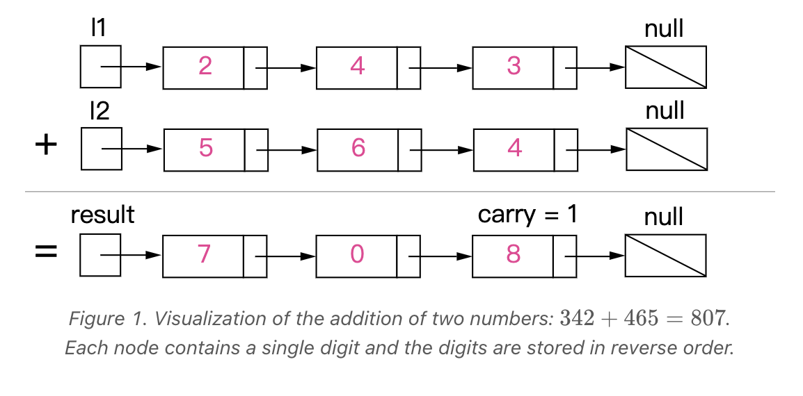

## 题目

### 题目难度：🔥🔥 中等

给你两个   非空 的链表，表示两个非负的整数。它们每位数字都是按照   逆序   的方式存储的，并且每个节点只能存储   一位   数字。

请你将两个数相加，并以相同形式返回一个表示和的链表。

你可以假设除了数字 0 之外，这两个数都不会以 0  开头。

### 示例 1

```bash
输入：l1 = [2,4,3], l2 = [5,6,4]
输出：[7,0,8]
解释：342 + 465 = 807.
```


### 示例 2

```bash
输入：l1 = [0], l2 = [0]
输出：[0]
```

### 示例 3

```bash

输入：l1 = [9,9,9,9,9,9,9], l2 = [9,9,9,9]
输出：[8,9,9,9,0,0,0,1]
```

## 解法

### 解法一：链表

#### 思路

模拟加法，逐位相加


#### 解题步骤

因为链表是逆序存储的，我们直接模拟加法，处理好进位就可以了。

- 定义单链表 `class` 节点或者 `function`
- 使用哑结点`（dummy）`，不用对头结点是否存在单独判断; 声明一个 `carry` 变量用于存储进位。
- `x` 的值为 `l1` 的 `val`，如果走到 `l1` 的尾部，设置为 `0`
- `y` 的值为 `l2` 的 `val`, 如果走到 `l2` 的尾部， 设置为 `0`
- 求和： `sum = val1 + val2 + carry`
- 求进位：`Math.floor(sum / 10)`
- 求链表对应的新值：`sum % 10`
- 创建新的结点，将新结点添加到链表中，并更新当前链表： `cur = cur.next`
- 更新 `l1` 和 `l2`

#### 复杂度

- 时间复杂度:
  `O(max(m,n))`，假设 `l1` 的长度是 `m`， `l2` 的长度是 `n`，时间复杂度就是两者的最大值。
- 空间复杂度:
  O(1)

  #### code

```javascript
/**
 * Definition for singly-linked list.
 * function ListNode(val, next) {
 *     this.val = (val===undefined ? 0 : val)
 *     this.next = (next===undefined ? null : next)
 * }
 */
/**
 * @param {ListNode} l1
 * @param {ListNode} l2
 * @return {ListNode}
 */
var addTwoNumbers = function (l1, l2) {
  const dummy = new ListNode(0);
  let curr = dummy;
  let carry = 0;
  while (l1 !== null || l2 !== null || carry !== 0) {
    let x = l1 ? l1.val : 0;
    let y = l2 ? l2.val : 0;
    let sum = x + y + carry;
    carry = Math.floor(sum / 10);
    curr.next = new ListNode(sum % 10);
    curr = curr.next;
    l1 = l1 ? l1.next : null;
    l2 = l2 ? l2.next : null;
  }

  return dummy.next;
};
```
