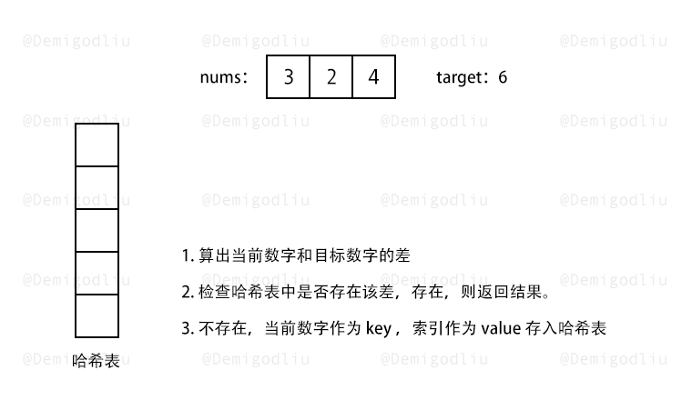

## 题目

给定一个整数数组 nums  和一个整数目标值 target，请你在该数组中找出 和为目标值 target  的那   两个   整数，并返回它们的数组下标。

你可以假设每种输入只会对应一个答案。但是，数组中同一个元素在答案里不能重复出现。

你可以按任意顺序返回答案。

#### 示例 1：

```bash
输入：nums = [2,7,11,15], target = 9
输出：[0,1]
解释：因为 nums[0] + nums[1] == 9 ，返回 [0, 1] 。


```

#### 示例 2：

```bash
输入：nums = [3,2,4], target = 6
输出：[1,2]
```

#### 示例 3：

```bash
输入：nums = [3,3], target = 6
输出：[0,1]
```

#### 提示：

- 2 <= nums.length <= $10^4
- -$10^9 <= nums[i] <= $10^9
- -$10^9 <= target <= $10^9
- 只会存在一个有效答案

#### 进阶：

你可以想出一个时间复杂度小于 `O($n^2)` 的算法吗？

## 代码

### 解法一：常规思路

思路简单，就是简单的暴力解决，当然也可以排序，再去找，这样子只要和比目标值大就下一次`外`循环，同时如果，当然还有很多优化点。
但是都是杯水车薪的小优化，本质循环需要两层，时间复杂福`O($n^2)`，要满足时间复杂度<`O($n^2)`还需要换个思路.

```javascript
var twoSum = function (nums, target) {
  for (var i = 0; i < nums.length; i++) {
    for (var j = i + 1; j < nums.length; j++) {
      if (nums[i] + nums[j] === target) {
        return [i, j];
      }
    }
  }
};
```

### 解法二：hashMap 求解

本题难点主要在于如何想到使用哈希法去解题，使用哈希法的条件是去判断一个数是否出现在一个集合之中，而这道题可以转换为这样去理解：在遍历数组的每一个元素时，用 target 去减去当前遍历的元素，得到的那个元素就是要在集合中查找是否存在的数。

而本题需要注意的点是要使用 map 去充当哈希表，用 key 来保存数组元素，用 value 来保存数组下标，还需留意不要寻找到当前元素（如 case2 中的 nums[0]+nums[0]=target）

#### 解提思路

- 用 hashMap 存储遍历过的元素和对应的索引。
- 每遍历一个元素，看看 hashMap 中是否存在满足要求的目标数字。
- 所有事情在一次遍历中完成（用了空间换取时间）。
  

```javascript
const twoSum = (nums, target) => {
  const prevNums = {}; // 存储出现过的数字，和对应的索引

  for (let i = 0; i < nums.length; i++) {
    // 遍历元素
    const curNum = nums[i]; // 当前元素
    const targetNum = target - curNum; // 满足要求的目标元素
    const targetNumIndex = prevNums[targetNum]; // 在prevNums中获取目标元素的索引
    if (targetNumIndex !== undefined) {
      // 如果存在，直接返回 [目标元素的索引,当前索引]
      return [targetNumIndex, i];
    } else {
      // 如果不存在，说明之前没出现过目标元素
      prevNums[curNum] = i; // 存入当前的元素和对应的索引
    }
  }
};
```

```javascript
var twoSum = function (nums, target) {
  let map = new Map();
  for (let i = 0, len = nums.length; i < len; i++) {
    if (map.has(target - nums[i])) {
      return [map.get(target - nums[i]), i];
    } else {
      map.set(nums[i], i);
    }
  }
  return [];
};
```

java

```javascript
class Solution {
    public int[] twoSum(int[] nums, int target) {
        Map<Integer, Integer> hashtable = new HashMap<Integer, Integer>();
        for (int i = 0; i < nums.length; ++i) {
            if (hashtable.containsKey(target - nums[i])) {
                return new int[]{hashtable.get(target - nums[i]), i};
            }
            hashtable.put(nums[i], i);
        }
        return new int[0];
    }
}

```

:::success{title="Map 知识回顾"}

1.Map
Map
Map 是一组键值对的结构，具有极快的查找速度。

举个例子，假设要根据同学的名字查找对应的成绩，如果用 Array 实现，需要两个 Array：

```javascript
var names = ['Michael', 'Bob', 'Tracy'];
var scores = [95, 75, 85];
```

给定一个名字，要查找对应的成绩，就先要在 names 中找到对应的位置，再从 scores 取出对应的成绩，Array 越长，耗时越长。

如果用 Map 实现，只需要一个“名字”-“成绩”的对照表，直接根据名字查找成绩，无论这个表有多大，查找速度都不会变慢。用 JavaScript 写一个 Map 如下：

```javascript
var m = new Map([
  ['Michael', 95],
  ['Bob', 75],
  ['Tracy', 85],
]);
m.get('Michael'); // 95
```

初始化 Map 需要一个二维数组，或者直接初始化一个空 Map。Map 具有以下方法：

```javascript
var m = new Map(); // 空Map
m.set('Adam', 67); // 添加新的key-value
m.set('Bob', 59);
m.has('Adam'); // 是否存在key 'Adam': true
m.get('Adam'); // 67
m.delete('Adam'); // 删除key 'Adam'
m.get('Adam'); // undefined
console.log(m); //{ 'Adam' => 67, 'Bob' => 59 }
```

由于一个 key 只能对应一个 value，所以，多次对一个 key 放入 value，后面的值会把前面的值冲掉：

```javascript
var m = new Map();
m.set('Adam', 67);
m.set('Adam', 88);
m.get('Adam'); // 88
```

Set

Set 和 Map 类似，也是一组 key 的集合，但不存储 value。由于 key 不能重复，所以，在 Set 中，没有重复的 key。

要创建一个 Set，需要提供一个 Array 作为输入，或者直接创建一个空 Set：

```javascript
var s1 = new Set(); // 空Set
var s2 = new Set([1, 2, 3]); // 含1, 2, 3
```

重复元素在 Set 中自动被过滤：

```javascript
var s = new Set([1, 2, 3, 3, '3']);
s; // Set {1, 2, 3, "3"}
```

注意数字 3 和字符串'3'是不同的元素。

通过 add(key)方法可以添加元素到 Set 中，可以重复添加，但不会有效果：

```javascript
s.add(4);
s; // Set {1, 2, 3, 4}
s.add(4);
s; // 仍然是 Set {1, 2, 3, 4}
```

通过 delete(key)方法可以删除元素：

```javascript
var s = new Set([1, 2, 3]);
s; // Set {1, 2, 3}
s.delete(3);
s; // Set {1, 2}
```

:::
