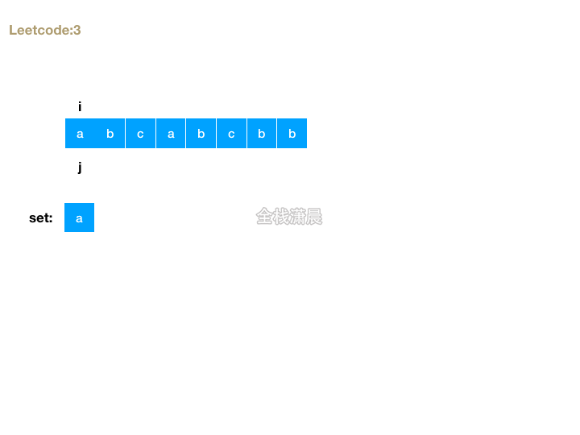

## 题目

### 题目难度：🔥🔥 中等

给定一个字符串 `s`，请你找出其中不含有重复字符的 `最长子串` 的长度。

### 示例 1

```bash
输入: s = "abcabcbb"
输出: 3
解释: 因为无重复字符的最长子串是 "abc"，所以其长度为 3。
```

### 示例 2

```bash
输入: s = "bbbbb"
输出: 1
解释: 因为无重复字符的最长子串是 "b"，所以其长度为 1。
```

### 示例 3

```bash

输入: s = "pwwkew"
输出: 3
解释: 因为无重复字符的最长子串是 "wke"，所以其长度为 3。
     请注意，你的答案必须是 子串 的长度，"pwke" 是一个子序列，不是子串。


```

#### 提示：

- 0 <= s.length <= 5 \* $10^4
- s 由英文字母、数字、符号和空格组成

## 代码

### 解法：滑动窗口

- 思路：滑动窗口不断向前，当前元素不在 `set` 中 就加入 `set` 然后更新最大长度，`i++`继续下一轮循环，`set` 中有重复元素不断让 `j++` 并删除窗口之外的元素 直到滑动窗口内没有重复的元素
- 复杂度：时间复杂度 `O(n)`，`n` 是字符串的长度。空间复杂度是 `O(n)`，即 `set` 的空间，最差的情况是 `O(n)`



代码

```javascript
var lengthOfLongestSubstring = function (s) {
  const set = new Set(); //判断滑动窗口内是否有重复元素
  let i = 0, //滑动窗口右边界
    j = 0, //滑动窗口左边界
    maxLength = 0;
  if (s.length === 0) {
    //极端情况
    return 0;
  }
  for (i; i < s.length; i++) {
    if (!set.has(s[i])) {
      //当前元素不在set中 就加入set 然后更新最大长度，i++继续下一轮循环
      set.add(s[i]);
      maxLength = Math.max(maxLength, set.size);
    } else {
      //set中有重复元素不断让j++ 并删除窗口之外的元素 直到滑动窗口内没有重复的元素
      while (set.has(s[i])) {
        set.delete(s[j]);
        j++;
      }
      set.add(s[i]); //放心将s[i]加入set中
    }
  }
  return maxLength;
};
```

- java

```javascript
class Solution {
    public int lengthOfLongestSubstring(String s) {
        Set<Character> set = new HashSet<Character>();
        int n = s.length();
        int j = -1, ans = 0;
        for (int i = 0; i < n; ++i) {
            if (i != 0) {
                set.remove(s.charAt(i - 1));
            }
            while (j + 1 < n && !set.contains(s.charAt(j + 1))) {
                set.add(s.charAt(j + 1));
                ++j;
            }
            ans = Math.max(ans, j - i + 1);
        }
        return ans;
    }
}
```
